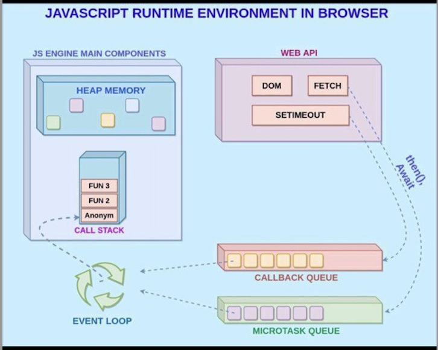

- JavaScript nima?
- JS'ni githubga bo'glash
- JavaScriptni codini compile qilish
- NodeJS o'rnatish.

JavaScript, brauzerlarda veb-saytlarni yaratishda ishlatiladigan dasturlash tilidir. Ushbu til yordamida, veb-saytlarda interaktivlik yaratish, ma'lumotlarni o'qish va yozish, animatsiyalar yaratish mumkin.

JavaScript kodini GitHubga joylashning bir qatori usullari mavjud. GitHub, kodni saqlash, boshqalar bilan ulashish va jamoaga kodni birlashtirish uchun xizmat qiladigan platformadir.

JavaScript kodini kompilyatsiya qilish, ya'ni uni boshqa tilda (masalan, TypeScript, Babel yoki CoffeScript) interpretilgan kodga o'zgartirish va uni ishga tushirishni anglatadi.

Node.js JavaScript dasturlash tilini server tomonida ishlatishga imkoniyat beradi. Bu platforma, JavaScript tilidagi dasturlarni kompyuter serverida (masalan, veb-serverida) ishga tushirish uchun ishlatiladi. Node.js yordamida JavaScript dasturlarini yozish, ishga tushirish va server tomonidagi boshqa amallarni bajarish mumkin.

Bu qadamlar JavaScript bilan ishlashda muhimdir, chunki ular JavaScript kodini tuzatish, ulashish va ishga tushirish imkoniyatlarini beradi.

## Question:

1. JavaScript nima?
2. Nodejs nima uchun kerak?
3. JavaScript code'ni necha hil usulda ishlatib(compile) ko'rsak bo'ladi?

## Answer:

- JavaScript brauzerlarda veb-saytlarni interaktiv ravishda yaratishda ishlatiladigan dasturlash tilidir. Bu til yordamida veb-saytlarda foydalanuvchilar bilan bo'g'liqli interaktivlik yaratish, ma'lumotlarni o'qish, yozish va saqlash, animatsiyalar va ko'p boshqa narsalarni bajarish mumkin. JavaScript single-thread, dynamic-type and weak-type multi paradigm interpretator programming language.

- Node.js esa JavaScript tilini server tomonida ishlatishga imkoniyat beradigan bir platformadur. Node.js orqali JavaScript tilidagi dasturlarni ishga tushirish, serverda fayllarni o'qish-yozish, veriylarni saqlash va boshqa server-to'g'ri amallarni bajarish mumkin.

1. JavaScript kodi ko'rib chiqish, kompilyatsiya qilish mumkin va shuningdek JavaScript kodini bajarishga ko'rib chiqish uchun bir nechta usullar mavjud. Bu usullar shu jumlada:

2. Brauzer orqali ishlatish: Brauzerda JavaScript kodini boshqarish uchun ishlatiladi. HTML faylida <script> tegi orqali skriptni joylash va brauzerda HTML sahifasini yuklash orqali ishga tushiriladi.

3. Kompyuterda o'z ishletish: Node.js yordamida JavaScript fayllarni kompyuterda o'z ishletish mumkin. Node.js yordamida JavaScript fayllarni ishga tushirish, ma'lumotlar bilan ishlash, fayllarni o'qish-yozish va boshqalar kabi server-to'g'ri amallarni bajarish mumkin.

4. Transpiling: Bu, JavaScript tilidagi kodni boshqa dasturlash tillariga (masalan, TypeScript, CoffeeScript) o'girib chiqishni anglatadi. Bu, kodni boshqa tillarga o'girib chiqish, keyinchalik uni ishga tushirish uchun foydalaniladi.

5. Minification: JavaScript kodi o'lchamini kichiklashtirish (minify) - bu bo'sh joylarni olib tashlab, kodni kichikroq hajmga keltirib chiqish.

JavaScriptni bular ichida yoki boshqa usullarda ishlatishning har biri, kodni bajarish va o'tkazishning mavzudagi maqsad va talablariga bog'liq bo'ladi.
